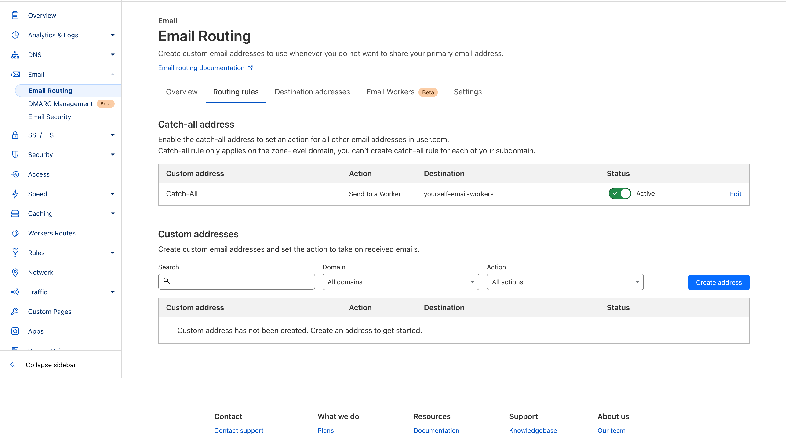
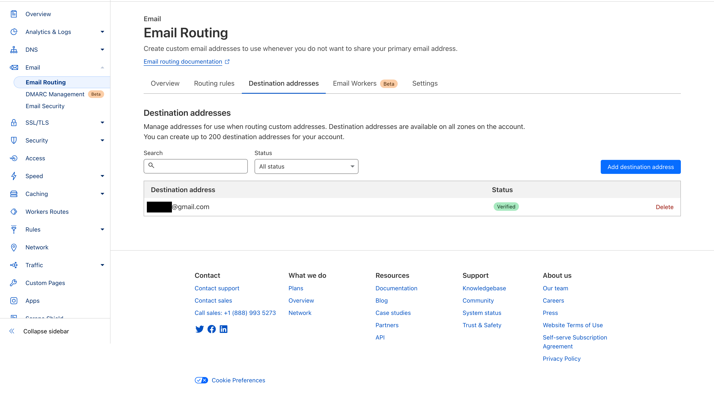

<div align="center">
  
  <h3><a href="/">yourself-email</a></h3>
  <p><em>使用 Cloudflare 来构建你自己的邮件系统，无需服务器</em></p>

  
  <a href="https://github.com/hocgin/yourself-email/blob/main/README-zh-CN.md"></a>
  <a href="https://github.com/hocgin/yourself-email/blob/main/README.md"></a>
</div>

### 效果展示

> 演示地址: http://mail.hocg.in, 使用你的任意邮箱登录。
>
> 目前已配置默认权限，登录后可以可读/发邮箱: test@hocg.in 和 test2@hocg.in

<div style="display:inline-block">
  
  
</div>

### 部署流程

<details open>
<summary>1. 创建数据库</summary>

#### 初始化数据库

```shell
# 创建数据库
npx wrangler d1 create yourself-email

# 将控制台显示的数据库配置写入 pages/wrangler.toml 和 workers/wrangler.toml 中的 [[d1_databases]]

cd pages

# 执行建表语句
npx wrangler d1 execute yourself-email --remote --file=./migrations/0001_create_table.sql

# =========== ⚠️ 配置权限 ===========
# 配置超级管理员权限
npx wrangler d1 execute yourself-email --remote --command "INSERT INTO UserConfig(email, is_super_admin, read_mail, sent_mail) VALUES ('hocgin@gmail.com', true, '*', '*')";
# 配置默认登录账号权限
npx wrangler d1 execute yourself-email --remote --command "INSERT INTO UserConfig(email, is_super_admin, read_mail, sent_mail) VALUES ('*', false, 'test@hocg.in', 'test@hocg.in')";
```

</details>

<details open>
<summary>2. 部署邮件接收端(Workers) / 接收邮件</summary>

#### 部署项目

```shell
cd workers

npm run deploy
```

#### 配置项目

##### 配置数据库 D1

选择数据库 `yourself-email`, 并设置变量名为 DB


##### 配置 Email Routing

1. 登录 [Cloudflare](https://dash.cloudflare.com/) 选择你要使用的域名
2. 左侧菜单依次进入 Email > Email Routing > Email Workers，开启 Email Routing
3. 指定转发到 yourself-email-workers
   
4. 配置域名 DNS
   

⚠️ 此处需要添加一个验证过的邮箱


#### 配置域名解析

</details>

<details open>
<summary>3. 部署邮件界面端(Pages) / 发送邮件</summary>

#### 部署项目

```shell
cd pages

npm run deploy
```

#### 配置项目

##### 配置数据库 D1

选择数据库 `yourself-email`, 并设置变量名为 DB


#### 配置 DNS 解析(Domain Lockdown)

> 配置允许通过 pages 域名进行发送邮件

| 记录            | 类型  | 内容                                              |
|---------------|-----|-------------------------------------------------|
| @             | TXT | v=spf1 a mx include:relay.mailchannels.net ~all |
| _mailchannels | TXT | v=mc1 cfid=yourself-email-pages.pages.dev       |

#### 配置 DKIM, 可选+推荐

> DKIM 是一种 DNS 记录，有助于防止电子邮件欺骗, 可以提高电子邮件的送达率。

##### 生成私钥和 DNS 记录

```shell
# 生成私钥
openssl genrsa 2048 | tee private_key.pem | openssl rsa -outform der | openssl base64 -A > private_key.txt

# 生成 DNS 记录
echo -n "v=DKIM1;p=" > dkim_record.txt && openssl rsa -in private_key.pem -pubout -outform der | openssl base64 -A >> dkim_record.txt
```

##### 配置 DNS 解析

| 记录                      | 类型  | 内容                                                                                                                     | 说明             |           
|-------------------------|-----|------------------------------------------------------------------------------------------------------------------------|----------------|
| _dmarc                  | TXT | v=DMARC1; s=mailchannels; p=reject; adkim=s; aspf=s; rua=mailto:xxx@gmail.com; ruf=mailto:xxx@gmail.com pct=100; fo=1; | 严格模式, 请替换自己到邮箱 |
| _dmarc                  | TXT | v=DMARC1; s=mailchannels; p=none; adkim=r; aspf=r;                                                                     | 宽松模式           |
| mailchannels._domainkey | TXT | dkim_record.txt 文件内容                                                                                                   |                |

- v=DMARC1: 指定DMARC记录的版本，这里是版本1。
- s=mailchannels: 表示DMARC策略的域，这里是 mailchannels。
- p=reject: 定义了如果电子邮件未能通过DMARC验证，接收方应该如何处理。这里是 reject，意味着直接拒绝该邮件。
- adkim=s: 指定了域名身份验证签名（DKIM）的策略，这里是 s（strict严格），意味着必须验证DKIM签名。
- aspf=s: 指定了发件方策略框架（SPF）的策略，这里是 s（strict严格），意味着必须验证SPF记录。
- rua=mailto:YYY: 指定了失败报告的电子邮件地址。当电子邮件未能通过DMARC验证时，接收方会向这个地址发送报告。mailto:YYY
  需要替换为实际的电子邮件地址。
- ruf=mailto:YYY: 指定了失败报告的电子邮件地址，用于发送更详细的失败信息。同样，mailto:YYY 需要替换为实际的电子邮件地址。
- pct=100: 定义了DMARC检查的电子邮件的百分比。这里是 100，意味着所有电子邮件都将被检查。
- fo=1: 指定了失败报告的选项。1 表示报告所有失败的记录，而不是仅报告那些未通过DMARC策略的记录。
  （注意：您提供的字符串中似乎缺少了 fo 参数的完整定义，通常它可能包含多个选项，如 1 表示请求完全的失败报告）

##### 配置 DKIM 变量(Pages)

- DKIM_DOMAIN: 邮箱域名, 如: hocg.in
- DKIM_SELECTOR: `dmarc` 中 s= 字段内容, 填 `mailchannels`
- DKIM_PRIVATE_KEY: `private_key.txt` 文件内容


</details>

----

### 待办清单

<details>

<summary>待办清单</summary>

- [x] 标记已读
- [x] 归档
- [x] 回收站
- [ ] 回收站、彻底删除
- [ ] 邮件添加标签
- [ ] 邮件详情，发送者显示邮件头部信息
- [x] 邮件详情，查询与X用户沟通历史
- [x] 权限设计实现
- [x] 用户状态，查询未读数量、权限账号列表
- [ ] 支持富文本编辑器
- [ ] 整理/开发 API 接口
- [ ] 移动端支持

</details>

----

### 相关资料

- [Shadcn UI](https://ui.shadcn.com/)
- [Prisma](https://www.prisma.io)
- [Cloudflare D1](https://developers.cloudflare.com/d1/build-with-d1)
- [MailChannels API](https://api.mailchannels.net/tx/v1/documentation)

